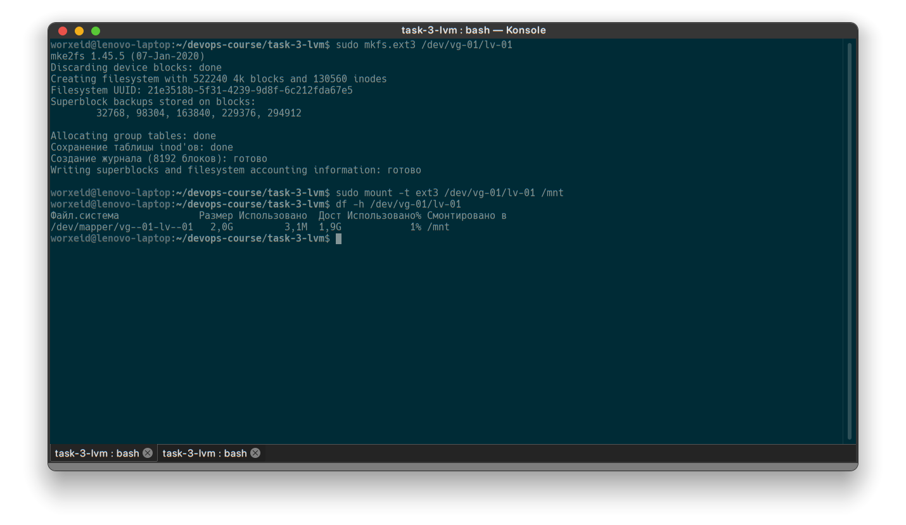
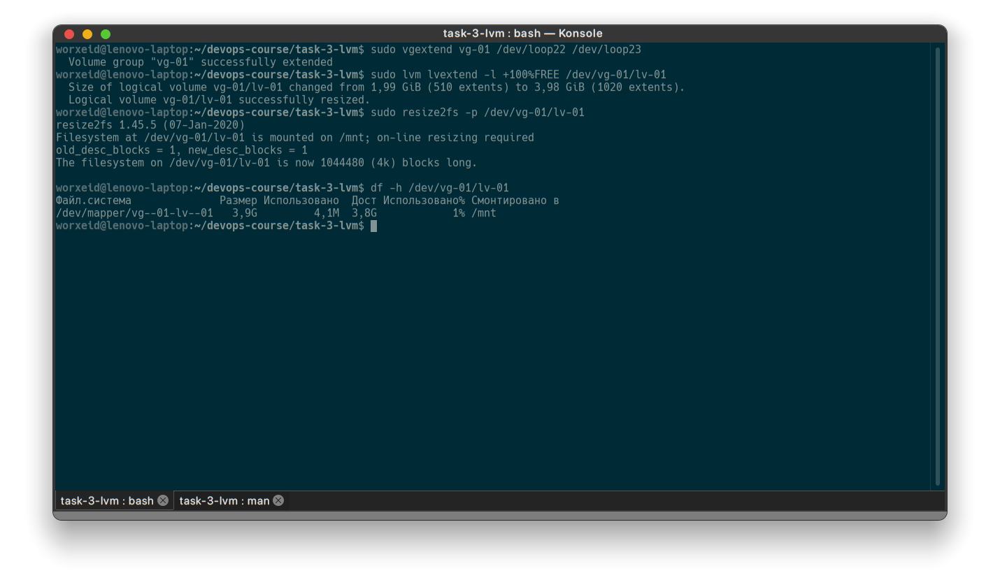

1. Создать 4 файла размером 1Гб каждый, создать loopback устройства из файлов при помощи losetup.

    ```bash
    sudo truncate -s 1G ./blockX
    sudo losetup /dev/loop2X ./blockX
    ```

2. Создать физические разделы на этих устройствах при помощи pvcreate. Создать volume group из первых двух девайсов. На ней создать logical volume при помощи lvcreate.

    ```bash
    sudo pvcreate /dev/loop20 /dev/loop21 /dev/loop22 /dev/loop23
    sudo vgcreate vg-01 /dev/loop20 /dev/loop21
    sudo lvcreate -L 1,99G -n lv-01 vg-01
    ```

3. Создать файловую систему при помощи mkfs.ext3, подмонтировать её, посмотреть какой размер.



4. Добавить оставшиеся два  устройства в группу. Изменить размер логического тома, затем размер файловой системы. Проверить размер при помощи df. В качестве результата сделать два скриншота команд.


